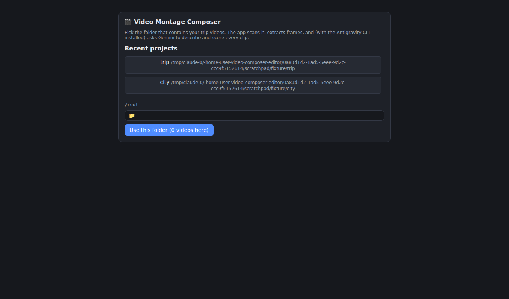
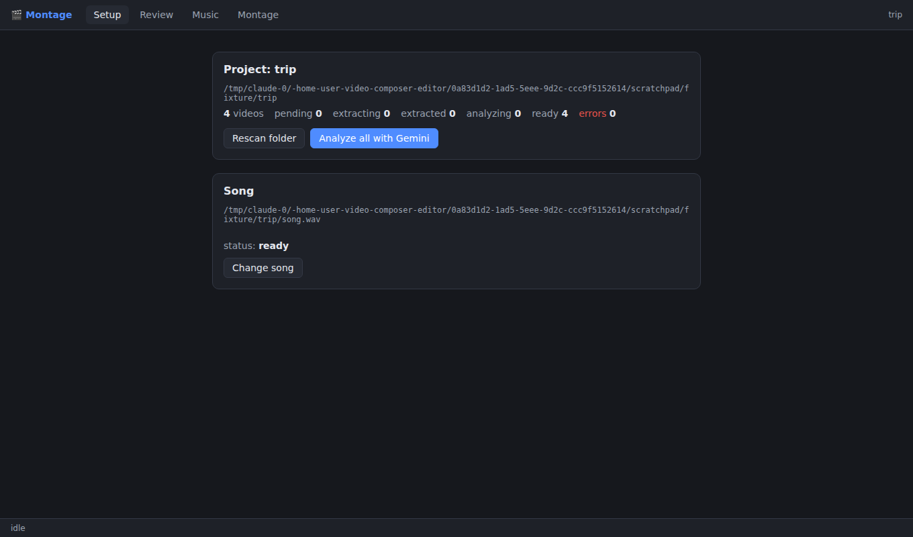
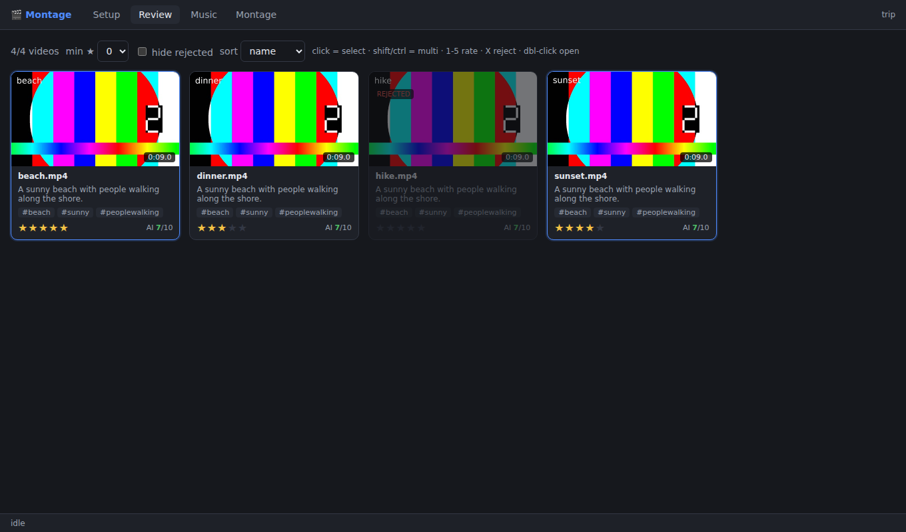
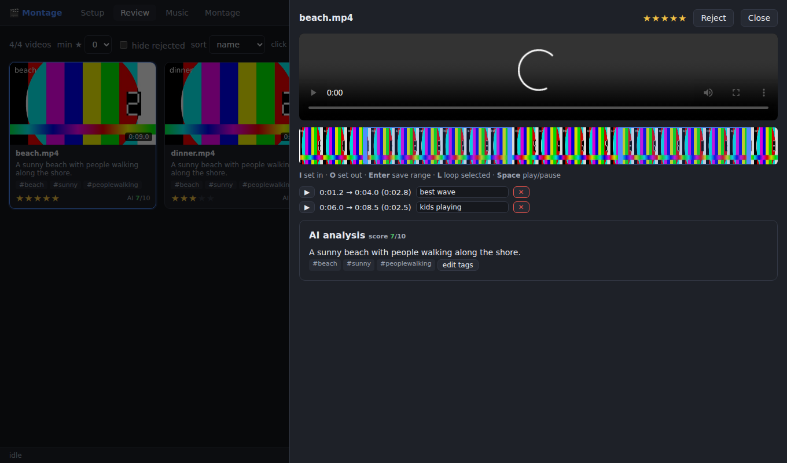
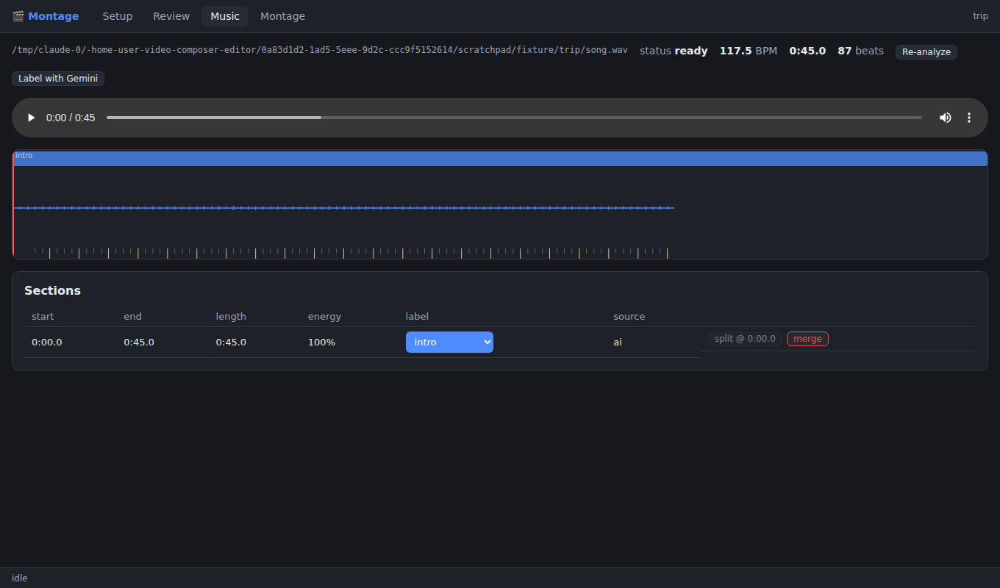
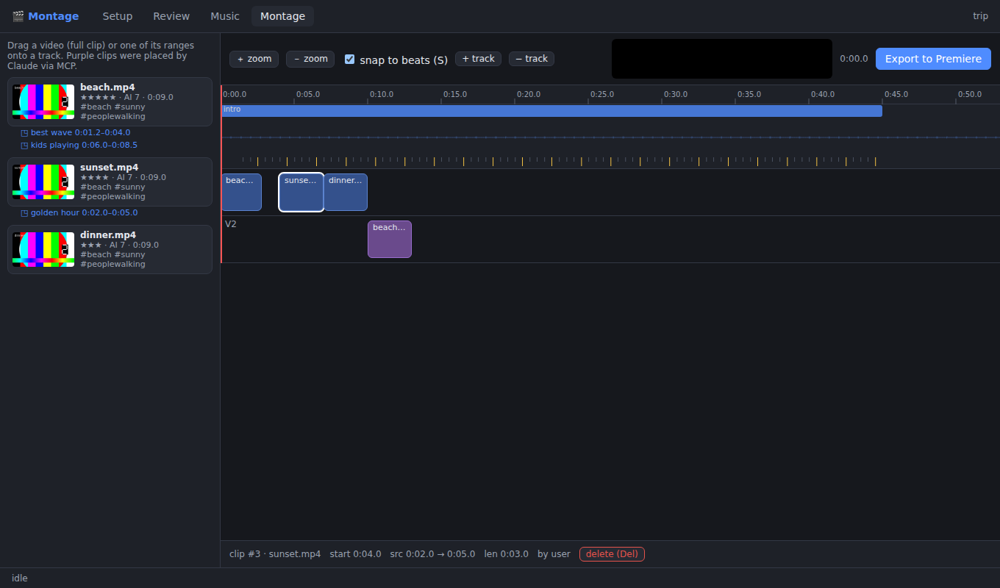
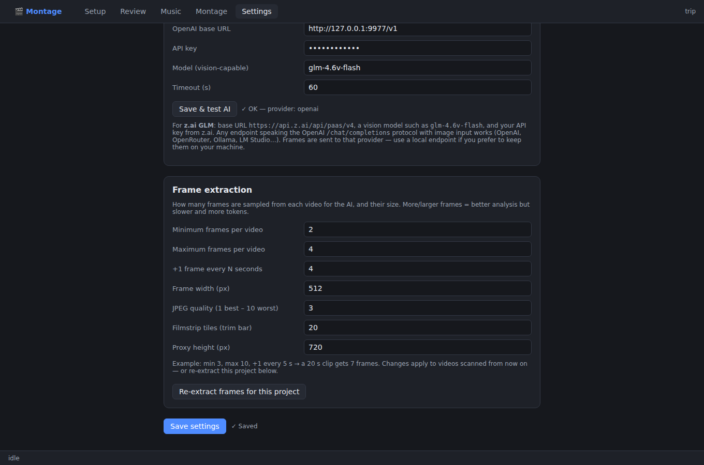

# User Manual

How to go from a folder of raw vacation videos to an Adobe Premiere Pro project,
step by step. (Screenshots use ffmpeg test footage — your real videos will look
better.)

- [Projects, autosave and switching](#projects-autosave-and-switching)
- [1. Create a project (Setup)](#1-create-a-project-setup)
- [2. Review and rate your clips](#2-review-and-rate-your-clips)
- [3. Mark the interesting parts](#3-mark-the-interesting-parts)
- [4. Analyze the song (Music)](#4-analyze-the-song-music)
- [5. Build the montage](#5-build-the-montage)
- [6. Let Claude place the clips for you](#6-let-claude-place-the-clips-for-you)
- [7. Export your montage](#7-export-your-montage)
- [8. Settings: AI provider and frame extraction](#8-settings-ai-provider-and-frame-extraction)
- [Keyboard shortcuts](#keyboard-shortcuts)
- [Troubleshooting](#troubleshooting)

---

## Projects, autosave and switching

The app is fully **multi-project** and there is no Save button — **everything
is saved automatically, instantly**, on every action: AI descriptions and
hashtags, your stars/rejects, in/out ranges, the song analysis with your
section edits, and the whole timeline.

Each project has a **storage folder** you choose and one or more **source
folders** of footage. All of its state lives in a SQLite database inside
`<storage>/.montage-cache/`, decoupled from the footage. That means:

- **Pull footage from several folders** — add as many source folders as you
  like (even on different drives), remove them, or **repoint** one that moved
  without losing a single clip's ratings, ranges or timeline placement.
- **Close anything anytime** — browser tab, server, reboot — and reopen the
  project later exactly where you left it (background jobs that were running
  can be re-queued with *Rescan* / *Analyze all*).
- **Open another project** whenever you want: click the **Beatcut** logo
  (top-left) to go back to the home screen, which lists your recent projects.
  You can even work on two projects at once in two browser tabs.
- **Move or import a project** — the storage folder is self-contained: copy it
  elsewhere and **Import project** from the home screen re-registers it with
  everything intact.
- **Back up / version a montage** by copying `.montage-cache/`; **reset** a
  project by deleting it.

## 1. Create a project (Setup)

Start the server (`uvicorn app.main:app --port 8765` from `backend/`) and open
<http://127.0.0.1:8765>. Click **New project**. On the page that opens, click
**Choose folder…** — your operating system's native dialog appears — to pick a
**storage folder** for the project (where its database will live; it can be
empty and separate from your footage; use the dialog's *New folder* button to
make one), optionally set a name, and hit **Create project**. Then, on the Setup
page, use the **Source folders** panel and **Add folder** to attach each folder
of footage (the same native dialog). If a native dialog isn't available (e.g. a
headless Linux box without `python3-tk`), an in-app folder browser is shown
instead.

For every source the app immediately:

1. scans the folder recursively for video files (`.mp4`, `.mov`, `.mts`, `.mkv`…),
2. reads duration/fps/resolution with ffprobe,
3. extracts frames (3–10 per clip depending on length), a thumbnail and a
   filmstrip,
4. transcodes a 720p H.264 proxy for clips the browser can't play (HEVC, 10-bit),
5. if the Antigravity CLI is available, sends the frames to **Gemini**, which
   writes a description, a 1–10 score and hashtags for every clip.

Progress appears in the **status bar at the bottom** — you can already open the
Review page while jobs run; results pop in live. Two clips with the same name in
different source folders coexist without clashing.

The Setup page shows counters per state (`pending → extracting → extracted →
analyzing → ready`). In the **Source folders** panel, **Add folder** attaches
another source, **✕** removes one (its clips leave the project; the files on disk
are untouched), and **Repoint…** relinks a source that moved. **Rescan all**
picks up files you added to or removed from any source later; **Analyze all with
Gemini** re-queues AI analysis (e.g. after installing `agy`).

Pick your **song** here too (bottom panel) — analysis starts right away.

> Everything the app generates lives in `<storage>/.montage-cache/`. Your
> original videos are never touched.

To bring in an existing project from another machine or a backup, click
**Import project** on the home screen and pick its storage folder (the one that
contains `.montage-cache/`).

## 2. Review and rate your clips

The **Review** page is your Lightroom-style culling grid. Every card shows the
thumbnail, duration, the AI description, its hashtags, the AI score, and your
star rating.

- **Hover scrub** (like Premiere/Final Cut): move the mouse horizontally over
  a thumbnail and the clip plays under your cursor — left edge is the start,
  right edge the end, with a time readout. Works in the montage bin too.
- **Click** a card to select it. **Ctrl/Cmd-click** adds to the selection,
  **Shift-click** selects a range.
- Press **1–5** to rate the selection, **0** to clear the rating, **X** to
  reject. Rejected clips dim out and never reach the montage bin or Claude.
- You can also click the stars on the card directly (clicking the current
  rating clears it).
- Filter with the top bar: free-text **search** (matches filename, description,
  tags and people; start with `#` to search hashtags only, `@` for people
  only), **subfolder** of the project, minimum stars, hide rejected, sort by
  name / AI score / stars / duration. Click any **#hashtag** or **@person**
  chip to filter by it.

Suggested workflow: sort by **AI score**, reject the junk with `X`, then give
4–5 stars to the must-haves.

## 2b. Know who's in each clip (People)

The **People** page detects the people appearing in your footage — locally on
your machine, nothing is uploaded. It needs the optional face libraries
(`pip install -e ".[faces]"` in `backend/`; the page tells you if they're
missing).

- Press **Detect people**: each clip is sampled every ~2 s and every face gets
  a compact "identity fingerprint". The first run downloads the face model
  (~280 MB) — later runs are offline.
- Similar faces are **grouped automatically**. Groups appear unnamed at the
  bottom; **type a name** ("Ana", "abuelo"…) to identify that person. Typing a
  name that **already exists merges** the two groups — the quickest way to fix
  the same person split in two.
- Once named, that person is **matched automatically** whenever you detect
  faces in new clips — and the matching **learns**: every face confirmed for a
  person covers another pose/lighting, so future matches get easier.
- Open **Faces** on a card (the face count is clickable too): **click a face**
  to view it large — the full frame with the face highlighted — and **👁**
  opens the video at that exact moment in a new tab. **📌** makes a face the
  card's cover picture, **↷** detaches a mis-grouped face and **🚫** marks a
  false positive as not-a-person. **Merge into…** joins whole groups;
  **Re-cluster** re-groups the unassigned faces (named people are never
  touched).
- **Hide** an unnamed group you're not interested in (strangers in the
  background): it moves to a collapsed **Hidden** section, but its faces are
  kept — new detections keep matching it instead of creating new unnamed
  groups. Unhide it anytime.
- Named people show as **@name chips** on the Review cards, and both the
  in-app AI composer and Claude (MCP `list_people`, `list_videos(person=…)`)
  see who appears in each clip — so "only clips with Ana" works as a montage
  instruction.

## 3. Mark the interesting parts

**Double-click** a card to open the detail view: a video player with a
**trim bar** rendered over the clip's filmstrip.

- Scrub by clicking anywhere on the filmstrip.
- Press **I** at the playhead to set the in point, **O** for the out point,
  **Enter** to save the range.
- A clip can hold **several ranges** ("best wave", "kids playing"…). Each row
  has ▶ (loop-play the range), an editable label, and ✕ to delete.
- Drag the blue **handles** of an existing range to fine-tune it.
- **L** toggles loop playback of the active range; **Space** plays/pauses.

These ranges become draggable items in the montage bin, and Claude prefers them
when auto-placing.

You can also fix the AI description/hashtags here (**edit tags**).

## 4. Analyze the song (Music)

The **Music** page shows what librosa extracted from your track: **BPM**, every
**beat** (yellow ticks = estimated downbeats), the **waveform**, and the
**structure sections** with their relative energy.

If the Antigravity CLI is available the sections come pre-labeled by Gemini
(intro / verse / chorus / bridge / …). To adjust:

- change any **label** with the dropdown (it becomes `source: user`),
- **split** a section at the playhead (play the song or click the waveform to
  position it first),
- **merge** a section into its neighbour,
- **Re-analyze** re-runs librosa from scratch; **Label with Gemini** re-asks
  only for the labels.

Good section boundaries matter: they're snap targets on the timeline and the
main hint Claude uses to decide where each kind of clip belongs.

### Lyrics & vocals (optional)

Enable **Settings → Music analysis — lyrics & vocals** to transcribe the song.
It runs automatically after the song analysis, or on demand with
**Transcribe lyrics**. Two engines (the **Engine** selector in Settings):

- **Whisper (local)** — requires `faster-whisper` in the backend environment.
  Private (nothing is uploaded) and with precise timestamps; the first run
  downloads the model.
- **Antigravity CLI (Gemini)** — no local model needed: the app re-encodes the
  song to a temporary AAC `.mp4` and Gemini listens to it natively. The audio
  is uploaded to Google and timestamps are approximate (~1s).
- **Auto** picks Whisper when installed, else the Antigravity CLI.

You get:

- a **Lyrics** panel with every sung line and its timestamp — click a line to
  jump there; the current line is highlighted during playback,
- a thin strip over the waveform: **green** where there are vocals, **teal**
  for melody-only (instrumental) passages,
- a **vocals** column per section (🎸 melody = no singing) — handy to place
  scenic footage on instrumental parts and people/action on the verses,
- better AI labels (repeated lyrics reveal the chorus), and the AI composer
  (Claude via MCP, agy or GLM) receives the lyrics and instrumental ranges to
  match footage to what the song says.

With the Whisper engine everything stays on your machine; with the Antigravity
CLI engine the song's audio is sent to Google for the transcription.

## 5. Build the montage

The **Montage** page has the **bin** on the left (all non-rejected videos,
best-rated first, with their saved ranges) and the **timeline** on the right:
ruler, song row (sections + waveform + beat ticks) and your video tracks.

- **Drag** a video — or one of its ranges — from the bin onto a track.
- **Right-click** a clip in the bin for quick actions: place it (or one of its
  ranges) at the playhead, open its detail (player, ranges, tags), jump to it
  in Review, rate or reject it. **Double-click** opens the detail directly.
- **Filter the bin** with the box at the top: free text, `#hashtag`, or a
  subfolder of your project.
- Drag a clip horizontally to move it, vertically to change tracks. Drag its
  **edges** to trim (limited by the source video's length).
- **Snap to beats (S)** magnetizes moves/trims to beats and section boundaries.
- Clips can't overlap on the same track; use several tracks (**+ track**) to
  layer alternatives, B-roll, etc. In the export, higher tracks sit on top in
  Premiere (V1 first).
- Click a clip to select it — the **inspector** at the bottom shows its exact
  times — and **Del** removes it. Purple clips were placed by Claude.
- **Space** plays the song with a best-effort jump-cut video preview (top-right
  box). The frame-accurate result comes later in Premiere.
- **+ / − zoom** rescale the timeline.

## 6. Let Claude place the clips for you

With the MCP server registered (see the README), open Claude Code / Claude
Desktop and just ask. Example prompt:

> Using the montage tools: put my best clips (4★+) on the chorus sections
> cutting on the beat, calmer 2–3★ clips on the verses, prefer each video's
> saved ranges, don't reuse a clip, and leave track 2 free for my manual
> overlays.

Claude reads the video descriptions/hashtags/ratings and the song structure,
then calls `place_clip` — you'll see purple clips appear on the timeline in
real time while the web app is open. Anything it gets wrong you can drag around
or delete like any other clip, or tell Claude to fix it (`move_clip`,
`clear_track`).

## 7. Export your montage

Click **Export** (top right of the Montage page) and pick your editor. All
three exports contain the same sequence — every cut at the right frame and the
song on the audio tracks — linked to the **original** files on disk:

- **Premiere Pro** → `montage.xml` (FCP7 XML / xmeml v5). In Premiere:
  **File → Import** and select the file; a bin appears with the sequence.
- **DaVinci Resolve** → `montage-resolve.xml` (the same FCP7 XML, which
  Resolve reads natively). In Resolve: **File → Import → Timeline**.
- **Final Cut Pro** → `montage.fcpxml` (FCPXML 1.9). In Final Cut:
  **File → Import → XML**. FCP has a magnetic storyline instead of free
  tracks, so the clips arrive as connected clips above the primary storyline
  (track 1 = lane 1, higher tracks on top) with the song underneath — the
  timeline positions are preserved exactly.

If the editor shows clips offline (e.g. different drive letter/mount), relink
them: **Link Media** in Premiere, **Relink Media** in Resolve, **File →
Relink Files** in Final Cut.

From there, finish it: transitions, color grading, reframes, audio mix.

## 8. Settings: AI provider and frame extraction

The **Settings** page (in the top navigation) configures the whole app; the
values are global and persist in `~/.video-montage-composer/settings.json`.

### AI provider

Choose who analyzes your video frames and labels the song sections:

- **Auto** *(default)* — uses the Antigravity CLI if installed, otherwise the
  OpenAI-compatible endpoint if configured.
- **Antigravity CLI (Gemini)** — the `agy` command; the command template is
  editable in case the CLI lives elsewhere or its flags change.
- **OpenAI-compatible endpoint** — any service speaking the OpenAI
  `/chat/completions` protocol with image input. For **z.ai GLM** the base URL
  depends on your plan:
  - **API plan**: `https://api.z.ai/api/paas/v4` with a vision model such as
    `glm-4.6v-flash`;
  - **Coding Plan**: `https://api.z.ai/api/coding/paas/v4` with e.g. `glm-4.7`
    or `glm-4.6v` (the coding models accept images too). Note a Coding Plan
    key is only valid on the coding endpoint, not the general one.

  Also works with OpenAI, OpenRouter, or a fully local Ollama / LM Studio
  (leave the API key empty if the endpoint doesn't need one).
- **Disabled** — no AI; rating and manual tagging still work.

**Save & test AI** sends a tiny prompt through the selected provider and shows
the result, so you can validate the key/URL before analyzing hundreds of clips.
Privacy note: the extracted frames are sent to whichever provider you choose —
use a local endpoint if you don't want them leaving your machine.

### Frame extraction

Controls how each video is sampled for analysis:

- **Minimum / maximum frames per video** and **+1 frame every N seconds** —
  e.g. min 3, max 10, +1 every 5 s means a 20 s clip yields 7 frames. More
  frames give the AI a better view of long clips but cost more tokens/time.
- **Frame width** and **JPEG quality** — resolution of the frames sent to the
  AI.
- **Filmstrip tiles** — how many thumbnails compose the trim-bar strip.
- **Proxy height** — resolution of the H.264 preview proxies.

Changes apply to newly scanned videos. To apply them to an existing project,
open Settings *from inside the project* and click **Re-extract frames for this
project** — derived frames/thumbnails/filmstrips are regenerated in the
background (then use *Analyze all* with force if you also want fresh AI
descriptions).

## Keyboard shortcuts

| Page | Key | Action |
|---|---|---|
| Review | `1–5` / `0` | rate selection / clear rating |
| Review | `X` | toggle reject on the selection |
| Review | `Esc` | clear selection / close detail |
| Detail | `I` / `O` | set in / out point at playhead |
| Detail | `Enter` | save the drafted range |
| Detail | `L` | loop-play the active range |
| Detail | `Space` | play / pause |
| Montage | `Space` | play / pause the montage preview |
| Montage | `S` | toggle snap to beats/sections |
| Montage | `Del` | delete selected clip |

## Troubleshooting

- **"Analyze with Gemini" disabled / `agy not found`** — the Antigravity CLI
  isn't on the PATH of the shell that started the server. Install it, run `agy`
  once to sign in, restart the server (or set `AGY_CMD`).
- **A video shows status `error`** — hover the card to read the message; usually
  a corrupt file or unsupported stream. Fix/remove the file and **Rescan all**.
- **A source folder shows ⚠ "not found"** — it was moved or its drive isn't
  mounted. Click **Repoint…** on that source and pick its new location; the clips
  keep all their data.
- **Video won't play in the browser** — proxies are generated in the background;
  wait for the `media` job to finish. Check the status bar.
- **Song analysis is slow** — librosa takes ~10–30 s for a typical song on the
  first run; watch the status bar.
- **Claude doesn't see my project** — the `--project` path of `mcp_server.py`
  must be exactly the project's storage folder (the one with `.montage-cache/`
  inside).
- **Reset a project** — delete `<storage>/.montage-cache/` and add your source
  folders again (ratings, ranges and timeline live there too, so export first if
  you care).
